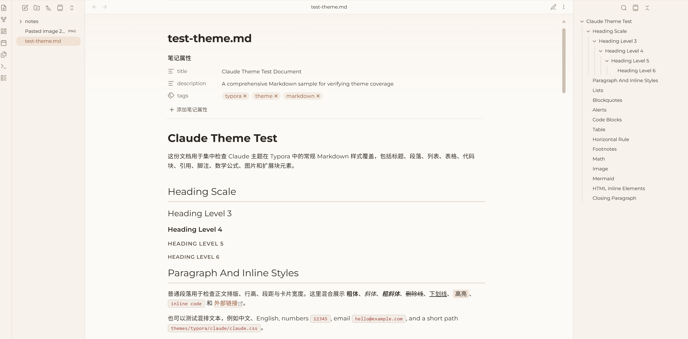
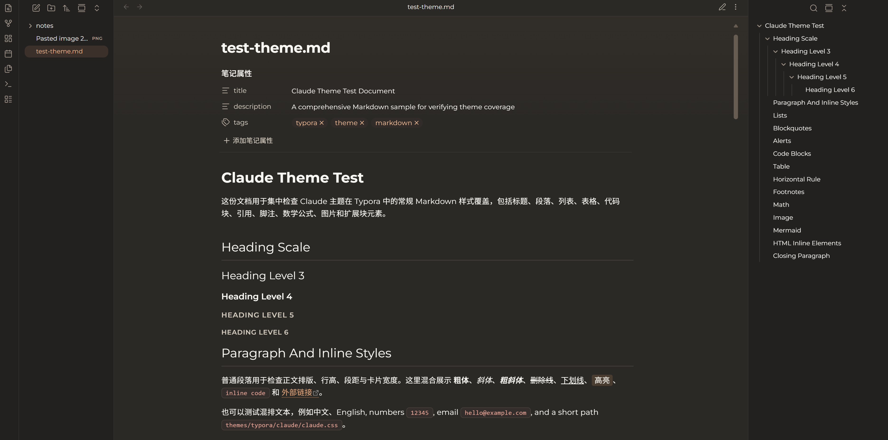

<p align="center">
  
</p>

[简体中文](README.md) | English

# Paperglow Theme

Paperglow is a warm paper-inspired theme for Typora and Obsidian. It replaces flat white canvases with sunlit paper tones, quiet burnt-clay accents, and a softer dark palette that feels closer to a late-night study than a terminal.

## Highlights

- Warm paper light mode and deep-ink dark mode
- Rounded reading-card surfaces for both writing and preview areas
- Unified Montserrat / Noto Sans SC / JetBrains Mono typography
- Soft quote blocks, 16px code blocks, clay-toned links, and consistent callouts

## Preview

### Typora

#### Light theme

<table>
  <tr>
    <td></td>
    <td></td>
  </tr>
  <tr>
    <td><em>Heading scale, body copy, inline styles, and lists</em></td>
    <td><em>Blockquotes, nested quotes, and note / tip / warning blocks</em></td>
  </tr>
  <tr>
    <td></td>
    <td></td>
  </tr>
  <tr>
    <td><em>Code blocks for Python, Shell, JSON, and CSS plus table styling</em></td>
    <td><em>Mermaid diagrams, shortcuts, and inline finishing details</em></td>
  </tr>
</table>

#### Dark theme

<table>
  <tr>
    <td></td>
    <td></td>
  </tr>
  <tr>
    <td><em>Heading scale, body copy, inline styles, and lists</em></td>
    <td><em>Blockquotes, nested quotes, and note / tip / warning blocks</em></td>
  </tr>
</table>

### Obsidian

<table>
  <tr>
    <td></td>
    <td></td>
  </tr>
  <tr>
    <td><em>Light paper palette, properties, outline sidebar, and reading view</em></td>
    <td><em>Deep-ink palette, properties, outline sidebar, and reading view</em></td>
  </tr>
</table>

## Supported Apps

| App | Theme | Status | Path |
|-----|-------|--------|------|
| Typora | Paperglow | ✅ Maintained | [`typora/`](typora/) |
| Obsidian | Paperglow | ✅ Maintained | [`obsidian/`](obsidian/) |

## Install

The repository ships with a lightweight installer script at [`install.py`](install.py), so you can install the theme directly without an extra packaging step.

### Typora

```bash
python install.py typora
```

Install to a custom theme directory:

```bash
python install.py typora --target-dir "C:\path\to\Typora\themes"
```

### Obsidian

```bash
python install.py obsidian
```

The script can discover local vaults automatically. To target a single vault:

```bash
python install.py obsidian --vault "/path/to/your/vault"
```

## Manual Install

### Typora

Copy [`paperglow.css`](typora/paperglow.css) and [`paperglow-dark.css`](typora/paperglow-dark.css) into your Typora themes directory. `paperglow-dark.css` uses `@import` to load `./paperglow.css`, so both files must exist together.

| Platform | Path |
|----------|------|
| Windows | `%APPDATA%\Typora\themes\` |
| macOS | `~/Library/Application Support/abnerworks.Typora/themes/` |
| Linux | `~/.config/Typora/themes/` |

### Obsidian

Copy [`theme.css`](obsidian/theme.css) and [`manifest.json`](obsidian/manifest.json) into `<vault>/.obsidian/themes/Paperglow/`, then select **Paperglow** in **Settings → Appearance → Themes**.

## Notes

### Typora Windows Unibody Title Bar

Paperglow styles the editor, sidebar, search panel, and part of Typora's HTML UI, but the default Windows title bar is still a native system control. If you want the top area to feel visually consistent with Paperglow, switch Typora to **Settings / Preferences → Appearance → Window Style → Unibody**, then restart Typora.

### Obsidian Highlights

- Shared Montserrat / Noto Sans SC / JetBrains Mono font system
- Warm paper light palette paired with a quieter deep-ink dark palette
- Card-like reading surfaces in both editing and reading views
- 16px code blocks, warm-gray blockquotes, clay-toned links, and aligned callouts

## License

Apache License 2.0
