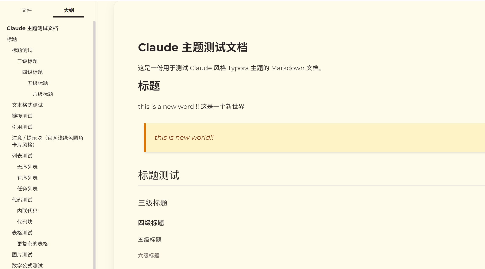

# Claude Theme for Typora

基于 Claude artifact 风格设计的 Typora Markdown 主题，采用 amber 暖色调配色与 Montserrat 几何无衬线字体。



## ✨ 特性

- **Amber 暖色调配色** - 源自 Claude artifact 的 amber-50/amber-100 色板
- **卡片式布局** - 16px 大圆角悬浮卡片，配合柔和阴影
- **Montserrat 字体** - 标题与正文统一使用 Montserrat，中文回退 Noto Sans SC / PingFang SC
- **现代代码风格** - 纯白背景 + 16px 大圆角代码块
- **Amber 引用卡片** - 左边框 + 阴影卡片风格的引用块
- **简洁表格** - 大写表头 + 底部分隔线风格
- **侧边栏高亮** - 大纲悬浮/选中时显示品牌 amber 色

## 📦 安装方法

### 方法一：手动安装

1. 下载 `claude.css` 文件

2. 打开 Typora 的主题文件夹：
   - **Windows**: `%APPDATA%\Typora\themes\`
   - **macOS**: `~/Library/Application Support/abnerworks.Typora/themes/`
   - **Linux**: `~/.config/Typora/themes/`

3. 将 `claude.css` 复制到主题文件夹

4. 重启 Typora

5. 在 `主题` 菜单中选择 **"Claude"**

### 方法二：通过 Typora 打开主题文件夹

1. 打开 Typora
2. 进入 `文件` → `偏好设置` → `外观` → `打开主题文件夹`
3. 将 `claude.css` 复制到打开的文件夹中
4. 重启 Typora
5. 选择 Claude 主题

## 🎨 配色方案

源自 Claude artifact 的 Tailwind amber / stone 色板。

### 表面色系

| 用途 | 颜色值 | 说明 |
|------|--------|------|
| 背景 | `#FFFBEB` | amber-50 |
| 卡片 | `#FFFBEB` | amber-50 |
| 边框 | `#D6D3D1` | stone-300 |

### 文本色系

| 用途 | 颜色值 | 说明 |
|------|--------|------|
| 主文本 | `#292524` | stone-800 |
| 次要文本 | `#57534E` | stone-600 |
| 元信息 | `#78716C` | stone-500 |

### 强调色

| 用途 | 颜色值 | 说明 |
|------|--------|------|
| 主强调 | `#D97706` | amber-600 |
| 按钮边框 | `#B45309` | amber-700 |
| 引用背景 | `#FEF3C7` | amber-100 |
| 引用文本 | `#78350F` | amber-900 |

## 🔤 字体规范

主题使用 Google Fonts 自动在线加载，**无需手动安装字体**。

- **标题 & 正文字体**: Montserrat (无衬线)
  ```
  "Montserrat", -apple-system, BlinkMacSystemFont, "Segoe UI", "Helvetica Neue", Arial, "Noto Sans SC", "PingFang SC", sans-serif
  ```

- **代码字体**: JetBrains Mono
  ```
  "JetBrains Mono", "SF Mono", SFMono-Regular, Menlo, Monaco, Consolas, monospace
  ```

> 离线使用：如需离线使用，可从 [Google Fonts](https://fonts.google.com) 下载并安装 Montserrat 和 Noto Sans SC 字体。

## 📁 文件说明

```
Typora-claude-theme/
├── claude.css             # 主题文件（安装此文件）
├── test-claude-theme.md   # 测试用 Markdown 文件
├── README.md              # 说明文档
└── demo.png               # 预览图片
```

## 🖼️ 支持的元素

- 六级标题 (H1-H6)
- 段落和文本格式（加粗、斜体、删除线、下划线、高亮）
- 链接
- 代码（内联代码 + 大圆角代码块）
- 引用块 / 提示卡片
- 有序/无序列表
- 任务列表
- 表格
- 图片
- 水平分割线
- 脚注
- 数学公式
- YAML Front Matter
- 目录 (TOC)

## 🌈 代码高亮

| 类型 | 颜色 | 色值 |
|------|------|------|
| 关键字 | 紫色 | `#A626A4` |
| 字符串/引用 | 绿色 | `#50A14F` |
| 函数定义/链接 | 蓝色 | `#4078F2` |
| 数字/原子值 | 橙黄 | `#986801` |
| 属性/变量2 | 橙棕 | `#C6613F` |
| 注释 | 灰色 | `#A0A1A7` |
| 变量/运算符 | 深灰 | `#383A42` |

## 📜 许可证

MIT License

## 🙏 致谢

- 配色方案源自 Claude artifact 的 Tailwind amber/stone 色板
- 字体方案参考 laper.ai (Montserrat + Noto Sans SC)
- 感谢 [Typora](https://typora.io) 提供优秀的 Markdown 编辑器
- 字体由 [Google Fonts](https://fonts.google.com) 提供

---

**Version 3.0.0** | Claude artifact amber palette + Montserrat typography
