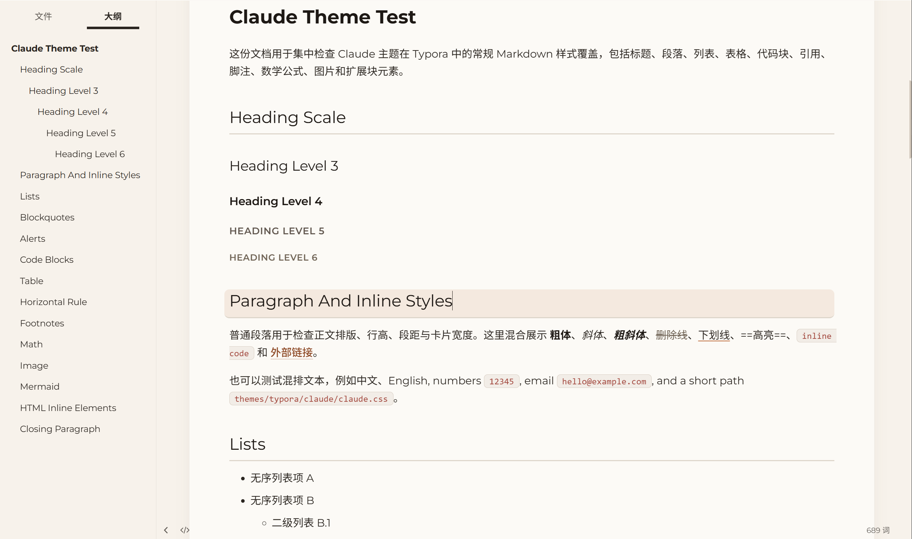
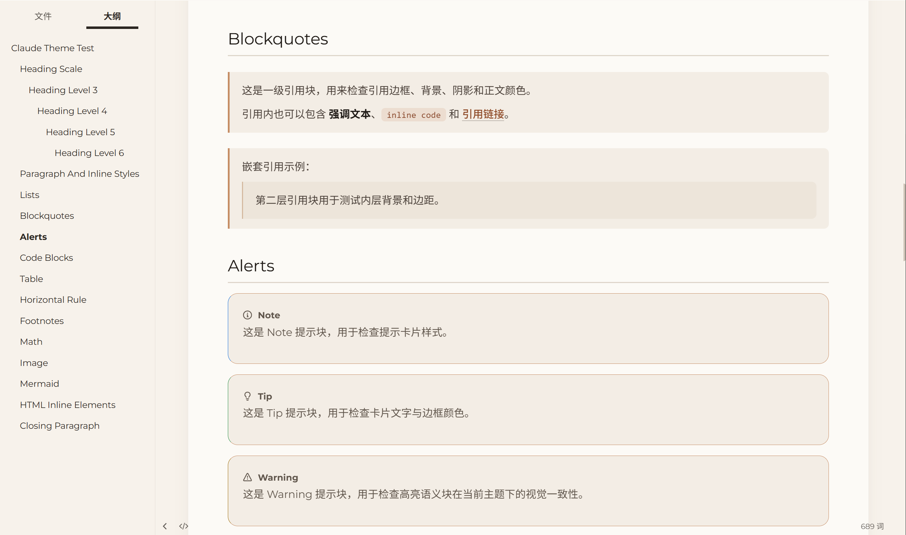
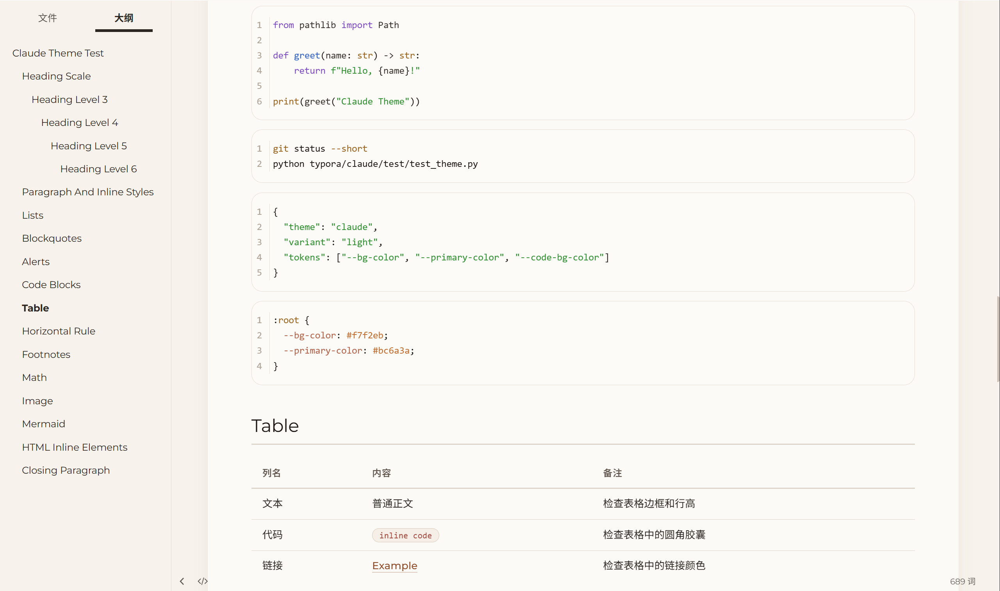

# 📜 Claude Style Themes

> 雨在窗外洗出一帧泛黄的过场 你拧亮桌角　铜锈里酿出的昏黄
>
> 从书架抽出一截　被布面缝住的时光 翻开 纸页漫出蜂蜜酿的光
>
> 指腹摩挲而过　像替谁抚平折了一半的衷肠 油墨安静卧在字间　不急着对谁声张
>
> 段落间的留白　是呼吸落脚的道场 你没注意排版
>
> 你只是顺着墨香　读进一条回不了头的长廊 窗外那场雨也在读你 等你合上书　它刚好落完最后一行

---

这套主题的设计理念很简单：把那个下雨天、那盏灯、那张纸还给你。

背景不是屏幕白，是日光晒过的书页——未漂白的棉纸，带着一点点奶黄，一点点温度。你盯着它看十分钟不会觉得刺眼，就像盯着一本摊开的旧书。到了夜里，它翻过一面，变成深夜书房的色调：不是程序员终端那种冰冷的纯黑，而是台灯光圈之外、书架木头上沉下去的那层暗棕。柔和的，安静的，让你的瞳孔不必在明暗之间反复挣扎。

正文区浮在窗口上方，像一张摊开的稿纸。圆角收边，投影极淡——纸总是比桌面亮一点的。你的视线会被这张卡片自然地收拢，世界缩小到文字和你之间。

强调色取自窑变的陶土。不是那些急于表现自己的荧光色，而是 `#bc6a3a`——一种烧过的暖橘，出现在链接、标签、引用块的左边线上，像你在书页空白处用老钢笔留下的一道批注。它不抢眼，但你每次视线扫过，都会知道那里有东西值得回来看。

字体只有一个。Montserrat，几何无衬线，从极细到粗体贯穿所有场景——标题用最轻的笔触写，正文用最舒服的字重读，界面用最安静的灰度退到背后。不是没想过加第二种字体，是不需要。一支好笔够写所有的字，靠的是运笔轻重，不是换笔。中文落在 Noto Sans SC 上，代码交给 JetBrains Mono，各得其所。

排版参照了 [laper.ai](https://laper.ai/) 的节奏——行高 1.5，表格对齐 [claude.ai](https://claude.ai) 的极细分隔线风格，引用块是暖灰的圆角容器配一条陶土左线，代码块安静地蹲在 16px 圆角的暗底里。每一个元素都在说同一句话：你好，我在这里，但我不打扰你。

这些颜色、间距、字重、圆角，最终指向同一件事——

**让你忘掉你在用电脑写字。**

---

## 🎨 预览

<table>
  <tr>
    <td></td>
    <td></td>
  </tr>
  <tr>
    <td><em>标题层级 · 段落 · 行内样式 · 列表</em></td>
    <td><em>引用块 · 嵌套引用 · Note / Tip / Warning</em></td>
  </tr>
  <tr>
    <td></td>
    <td></td>
  </tr>
  <tr>
    <td><em>代码块（Python / Shell / JSON / CSS）· 表格</em></td>
    <td><em>Mermaid 流程图 · 快捷键 · 上下标</em></td>
  </tr>
</table>

## 📦 支持的应用

| 应用 | 主题 | 状态 | 路径 |
|------|------|------|------|
| Typora | Claude | ✅ 主线维护 | [`themes/typora/claude/`](themes/typora/claude/) |
| Obsidian | Claude | ✅ 主线维护 | [`themes/obsidian/claude/`](themes/obsidian/claude/) |
| Obsidian | WizNote | 📦 legacy | [`themes/obsidian/wiznote/`](themes/obsidian/wiznote/) |

## 🚀 安装

仓库根目录有一个轻量安装脚本 [`install.py`](install.py)，一行命令，不做额外打包。

### Typora

```bash
python install.py typora
```

指定主题目录：

```bash
python install.py typora --target-dir "C:\path\to\Typora\themes"
```

### Obsidian

```bash
python install.py obsidian
```

脚本会自动检测所有 vault 并安装。指定单个 vault：

```bash
python install.py obsidian --vault "/path/to/your/vault"
```

## 🔧 手动安装

### Typora

将 [`claude.css`](themes/typora/claude/claude.css) 和 [`claude-dark.css`](themes/typora/claude/claude-dark.css) 一起复制到主题目录：

| 系统 | 路径 |
|------|------|
| Windows | `%APPDATA%\Typora\themes\` |
| macOS | `~/Library/Application Support/abnerworks.Typora/themes/` |
| Linux | `~/.config/Typora/themes/` |

### Obsidian

将 [`theme.css`](themes/obsidian/claude/theme.css) 和 [`manifest.json`](themes/obsidian/claude/manifest.json) 复制到 `<vault>/.obsidian/themes/Claude/`，然后在 **设置 → 外观 → 主题** 中选择 **Claude**。

## 🏗️ 项目结构

```
claude-style-themes/
├── install.py
├── themes/
│   ├── typora/claude/
│   │   ├── claude.css
│   │   ├── claude-dark.css
│   │   └── showcase/          ← demo 截图
│   └── obsidian/
│       ├── claude/
│       │   ├── theme.css
│       │   └── manifest.json
│       └── wiznote/
├── tests/
└── README.md
```

## 🧪 验证

```bash
python -m unittest tests.test_install -v
python themes/typora/claude/test/test_theme.py
python themes/obsidian/claude/test/test_theme.py
```

## 📄 许可证

Apache License 2.0
