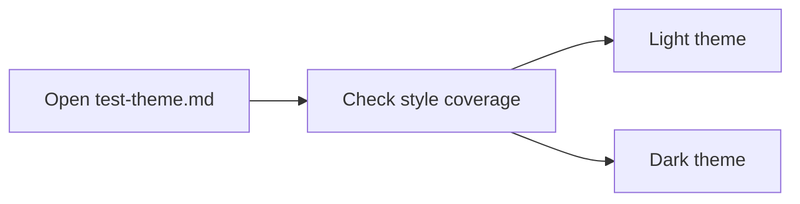

[TOC]

# Claude Theme Test

这份文档用于集中检查 Claude 主题在 Typora 中的常规 Markdown 样式覆盖，包括标题、段落、列表、表格、代码块、引用、脚注、数学公式、图片和扩展块元素。

## Heading Scale

### Heading Level 3

#### Heading Level 4

##### Heading Level 5

###### Heading Level 6

## Paragraph And Inline Styles

普通段落用于检查正文排版、行高、段距与卡片宽度。这里混合展示 **粗体**、*斜体*、***粗斜体***、~~删除线~~、<u>下划线</u>、==高亮==、`inline code` 和 [外部链接](https://example.com)。

也可以测试混排文本，例如中文、English, numbers `12345`, email `hello@example.com`, and a short path `themes/typora/claude/claude.css`。

## Lists

- 无序列表项 A
- 无序列表项 B
  - 二级列表 B.1
  - 二级列表 B.2
- 无序列表项 C

1. 有序列表项 1
2. 有序列表项 2
3. 有序列表项 3

- [ ] 已完成任务
- [x] 待完成任务
- [x] 需要回归检查的任务

## Blockquotes

> 这是一级引用块，用来检查引用边框、背景、阴影和正文颜色。
>
> 引用内也可以包含 **强调文本**、`inline code` 和 [引用链接](https://example.com/quote)。

> 嵌套引用示例：
>
> > 第二层引用块用于测试内层背景和边距。

## Alerts

> [!NOTE]
> 这是 Note 提示块，用于检查提示卡片样式。

> [!TIP]
> 这是 Tip 提示块，用于检查卡片文字与边框颜色。

> [!WARNING]
> 这是 Warning 提示块，用于检查高亮语义块在当前主题下的视觉一致性。

## Code Blocks

```python
from pathlib import Path

def greet(name: str) -> str:
    return f"Hello, {name}!"

print(greet("Claude Theme"))
```

```bash
git status --short
python typora/claude/test/test_theme.py
```

```json
{
  "theme": "claude",
  "variant": "light",
  "tokens": ["--bg-color", "--primary-color", "--code-bg-color"]
}
```

```css
:root {
  --bg-color: #f7f2eb;
  --primary-color: #bc6a3a;
}
```

## Table

| 列名 | 内容 | 备注 |
|------|------|------|
| 文本 | 普通正文 | 检查表格边框和行高 |
| 代码 | `inline code` | 检查表格中的圆角胶囊 |
| 链接 | [Example](https://example.com) | 检查表格中的链接颜色 |

## Horizontal Rule

---

## Footnotes

脚注示例可以检查引用编号和脚注区块样式。这里有一个脚注[^theme-note]，这里还有第二个脚注[^second-note]。

[^theme-note]: 这是第一个脚注内容。
[^second-note]: 这是第二个脚注内容，用来检查多条脚注之间的间距。

## Math

行内公式示例：$E = mc^2$。

块级公式示例：

$$
\int_{0}^{1} x^2 \, dx = \frac{1}{3}
$$

## Image


## Mermaid



## HTML Inline Elements

按键样式：<kbd>Ctrl</kbd> + <kbd>Shift</kbd> + <kbd>P</kbd>

上下标：H<sub>2</sub>O 与 x<sup>2</sup>

## Closing Paragraph

如果这份文档中的标题、正文、列表、引用、提示块、代码块、表格、图片、脚注、数学公式和 Mermaid 都显示正常，说明主题的常规 Markdown 样式覆盖已经比较完整。


